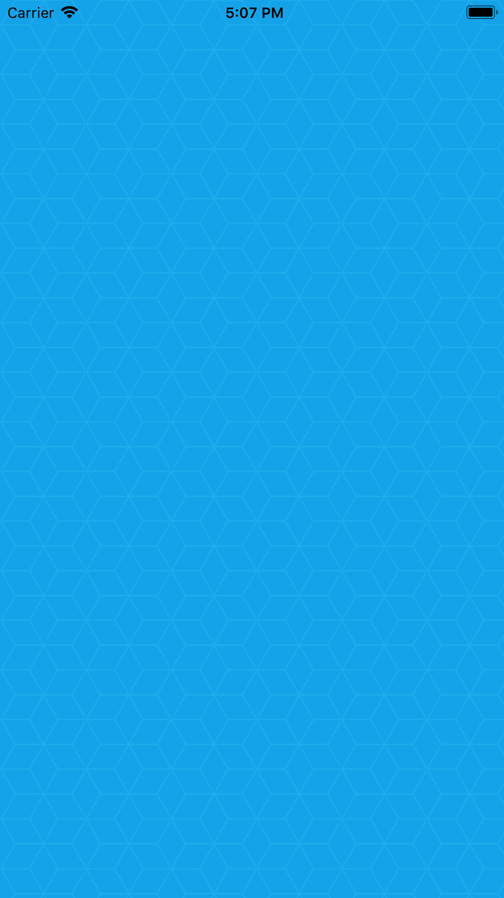

# HexPatternView

[](https://travis-ci.org/satish.babariya@gmail.com/HexPatternView)
[](http://cocoapods.org/pods/HexPatternView)
[](http://cocoapods.org/pods/HexPatternView)
[](http://cocoapods.org/pods/HexPatternView)

## Example

To run the example project, clone the repo, and run `pod install` from the Example directory first.

<h3 align="center">

</h3>

## Requirements

## Installation

HexPatternView is available through [CocoaPods](http://cocoapods.org). To install
it, simply add the following line to your Podfile:

```ruby
pod 'HexPatternView'
```

## Use

```swift

    let patternView = HexPatternView()
    view.addSubview(patternView)
    
    patternView.translatesAutoresizingMaskIntoConstraints = false
    patternView.topAnchor.constraint(equalTo: view.topAnchor).isActive = true
    patternView.bottomAnchor.constraint(equalTo: view.bottomAnchor).isActive = true
    patternView.leadingAnchor.constraint(equalTo: view.leadingAnchor).isActive = true
    patternView.trailingAnchor.constraint(equalTo: view.trailingAnchor).isActive = true
    
    view.backgroundColor = #colorLiteral(red: 0, green: 0.7022017837, blue: 0.9288000464, alpha: 1)
    patternView.setRhombusPattern()
    patternView.color = UIColor.white
    patternView.alpha = 0.1
    patternView.cellWidthMax = 70
    
```

## Author

Satish Babariya, satish.babariya@gmail.com

## License

HexPatternView is available under the MIT license. See the LICENSE file for more info.
